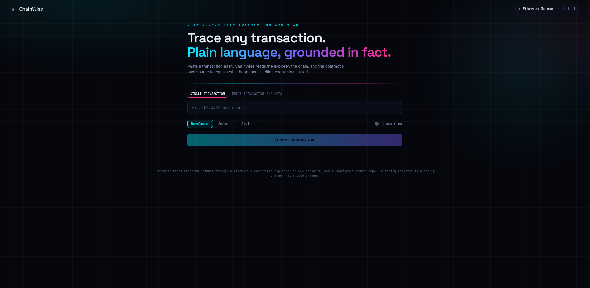
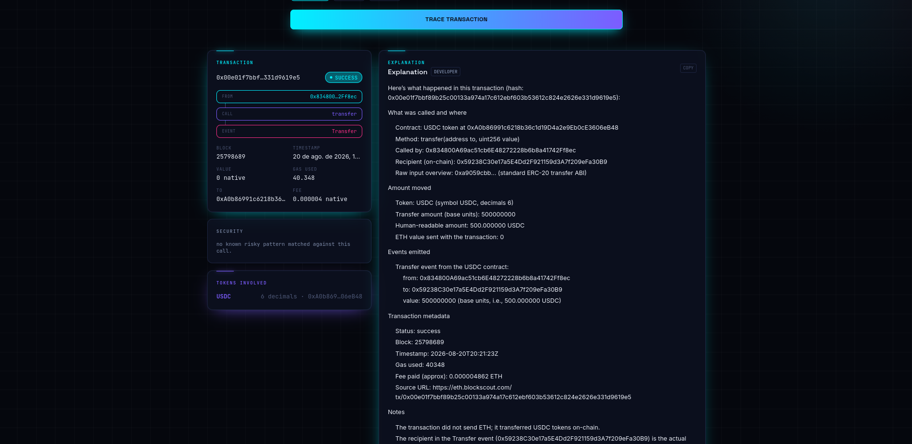

# ChainWise

ChainWise is an AI assistant that explains and troubleshoots EVM transactions. Give it a
transaction hash and it reads the explorer, the chain, and the contract's own source code, then
returns a plain language explanation with sources cited. It is network agnostic: switching from
Ethereum mainnet to another EVM network (Polygon PoS, Gnosis Chain, or your own private network)
is a config change, not a code change.

Built for the CloudWalk Nimbus 1.4 challenge ("AnyChain Transaction Assistant"). See
`docs/nimbus.md` for the original brief and `docs/planning.md` for the full implementation log.

<p align="center">
  
</p>

## What it does

- **Transaction explainer**: paste a hash, get a clear summary of what happened. Calls, value
  transfers, emitted events, all cited back to their source.
- **Failure diagnostics**: if a transaction reverted, get a structured diagnosis with likely root
  cause and next steps.
- **Structured triage**: if a call can't be decoded from any available source, ChainWise says so
  plainly and asks one specific question instead of guessing.
- **Multi transaction analysis**: analyze two or more related transactions together and see how
  they connect (shared sender, shared counterparty).
- **Explanation modes**: developer, support, or auditor. Same data, different audience.
- **Gas efficiency tips**: an optional section comparing gas used against typical ranges for the
  operation.
- **Security findings**: known risky call patterns (ownership transfers, unlimited approvals,
  upgrade calls) are flagged as fact, not inference.
- **Conversational follow ups**: every explanation opens a chat thread. Ask a follow up question,
  paste an ABI to unblock a triage question, or dig deeper into any part of the answer.
- **Grounded answers**: every response cites the explorer link, and the repo file when a contract
  is explained by matching its source ABI instead of the explorer's.

## Screenshots

| Search | Result |
|---|---|
|  |  |

Follow up questions stay in the same conversation, right next to the explanation:


## Project layout

```
chainwise/
  src/backend/    FastAPI + LangGraph agent (Python, uv)
  src/frontend/   React + Vite web UI (TypeScript)
  docs/           challenge brief, planning log, ADRs, examples
  docker-compose.yml   Postgres + backend
  Makefile        every command you need, see `make help`
```

## Requirements

- Python 3.13+ and [uv](https://docs.astral.sh/uv/)
- Node.js and [pnpm](https://pnpm.io/) (for the frontend)
- Docker (for the local Postgres instance)
- An [OpenRouter](https://openrouter.ai/) API key (required, this is what powers the explanations)
- A GitHub token (optional, only needed for repo grounding, see below)

## Quick start

1. Copy the backend env template and fill in your OpenRouter key:

   ```
   cp src/backend/.env.example src/backend/.env
   ```

   Open `src/backend/.env` and set `OPENROUTER_API_KEY`. `GITHUB_TOKEN` is optional, see
   "Repo grounding" below.

2. Install the frontend dependencies:

   ```
   cd src/frontend && pnpm install && cd ../..
   ```

3. Run everything (Postgres, backend, frontend) with one command:

   ```
   make dev
   ```

   The backend comes up on `http://localhost:8000`, the frontend on `http://localhost:5173` (or
   the next free port). Open the frontend URL, paste a transaction hash, and trace it.

Run `make help` to see every available command (lint, typecheck, test, docker build, and so on).

## Configuration

### Backend (`src/backend/.env`)

| Variable | Required | Purpose |
|---|---|---|
| `OPENROUTER_API_KEY` | yes | LLM access via OpenRouter |
| `OPENROUTER_MODEL` | no | defaults to a small, cheap model, override for a stronger one |
| `CHAINWISE_NETWORK` | no | which network config to load, defaults to `ethereum-mainnet` |
| `CHAINWISE_DATABASE_URL` | no | Postgres URL for LangGraph's conversation checkpoints |
| `GITHUB_TOKEN` | no | enables repo grounding, see below |

### Switching networks

Network config lives in `src/backend/chainwise/config/networks/`, one YAML file per network:
`ethereum-mainnet.yaml`, `polygon-pos.yaml`, `gnosis-chain.yaml`. Each one sets the explorer URL,
RPC URL, source repos to ground against, and ABI decoding strategy. To point ChainWise at a
different network, set `CHAINWISE_NETWORK` to the file name (without `.yaml`) or add a new YAML
file for a network that isn't there yet. No code changes needed, see ADR 0001 for why this is a
YAML file per network instead of one shared file.

### Repo grounding

When the explorer has no ABI for a call, ChainWise falls back to searching the network's
configured GitHub repos for a matching ABI artifact. This needs `GITHUB_TOKEN` because GitHub's
code search API rejects unauthenticated requests. Without a token, this fallback is skipped and
ChainWise degrades gracefully: it says the call couldn't be decoded and asks what it needs instead
of guessing.

### Frontend (`src/frontend/.env`, optional)

```
VITE_API_BASE=http://localhost:8000
```

Only needed if the backend isn't running on the default port.

## Running the backend only

```
make backend
```

Or with Docker (Postgres and backend together):

```
make up
```

## API

| Route | Purpose |
|---|---|
| `GET /network` | the active network config |
| `GET /tx/{hash}` | raw transaction summary, no LLM call |
| `GET /tx/{hash}/explain` | full explanation. Query params: `mode` (developer/support/auditor), `gas_tips` (true/false) |
| `GET /analyze?hash=...&hash=...` | explain two or more related transactions together |
| `POST /chat` | continue a conversation started by `/explain` or `/analyze`. Body: `{"thread_id": "...", "message": "..."}` |

Every `/explain` and `/analyze` response includes a `thread_id`. Pass it to `/chat` to keep asking
questions about the same transaction (or set of transactions).

See `docs/examples.md` for real requests and responses.

## Testing

```
make check
```

Runs lint (`ruff`), typecheck (`pyright`), and the full backend test suite (`pytest`), all
mocked, no real network calls. The frontend has its own typecheck and lint:

```
cd src/frontend && npx tsc -b && npm run lint
```

## Design notes

- `docs/adr/0001-network-config-as-per-network-yaml-files.md`: why network config is one YAML
  file per network.
- `docs/adr/0002-langgraph-agent-with-openrouter-llm.md`: why LangGraph for the agent pipeline
  and OpenRouter for the LLM.
- `docs/planning.md`: the full build log, including bugs found and fixed along the way.

## License

MIT, see `LICENSE`.
